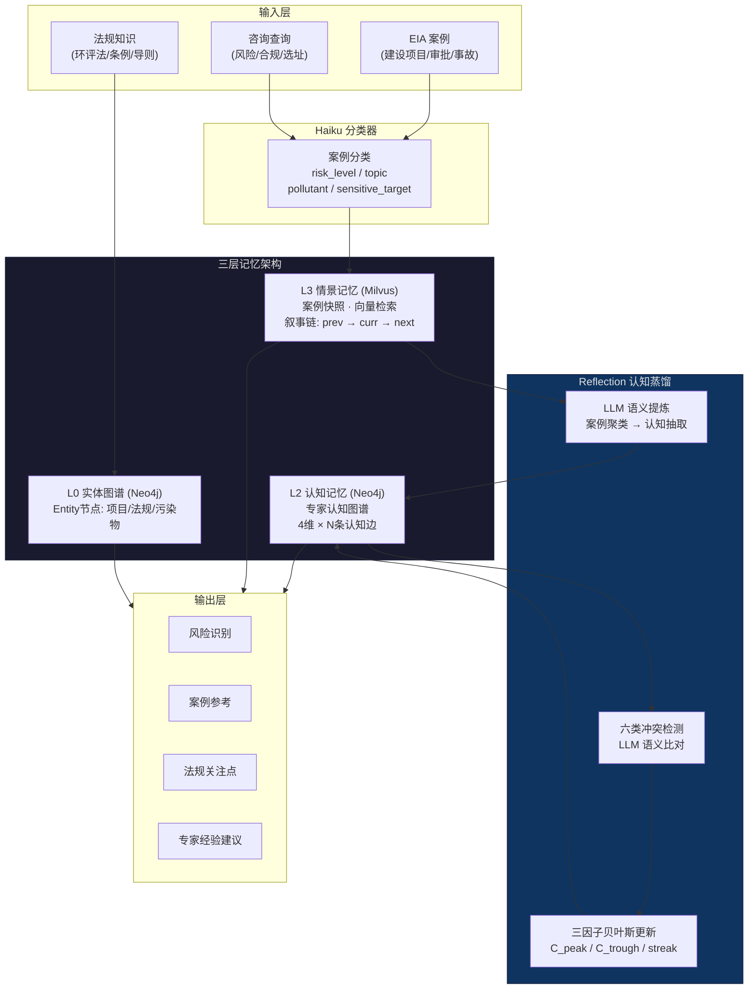
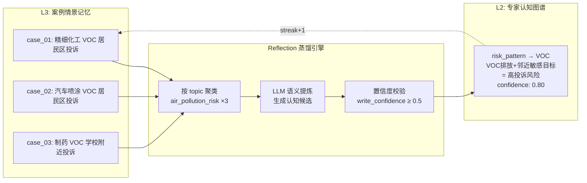
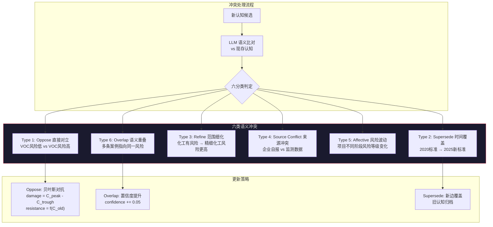
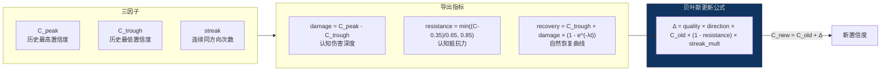
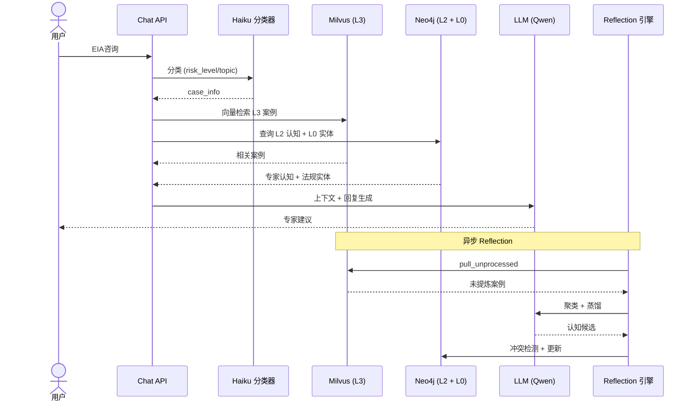

# EIA Expert Agent — 项目架构

## 一、系统全景

---

## 二、认知蒸馏链路 (L3 → L2)

---

## 三、六类冲突检测机制

---

## 四、三因子贝叶斯置信度演化

---

## 五、技术栈

| 层 | 技术 | 用途 |
|---|---|---|
| 编排 | **LangGraph** | 多节点有状态 Agent 编排 |
| 向量存储 | **Milvus** | L3 情景记忆向量检索 (COSINE/HNSW) |
| 图数据库 | **Neo4j** | L2 认知图谱 + Entity 节点关系 |
| 关系存储 | **MySQL** | L3-Cold 归档 + 会话管理 |
| LLM | **DashScope (Qwen)** | Reflection 蒸馏 + 冲突分类 + 案例分类 |
| Embedding | **BGE-Large-v1.5** | 768维中文语义向量 |
| Reranker | **BGE-Reranker-v2-m3** | 检索结果重排序 |

---

## 六、数据流时序

---

## 七、简历可用的一句话架构描述

> 基于 LangGraph + Milvus + Neo4j 构建三层认知记忆架构（L3情景/L2语义/L0实体），
> 通过 LLM驱动的 Reflection 蒸馏引擎实现案例到专家认知的自动转化，
> 配合六类语义冲突检测和三因子贝叶斯置信度演化机制，
> 形成可长期沉淀和动态更新的 EIA 专家认知系统。
